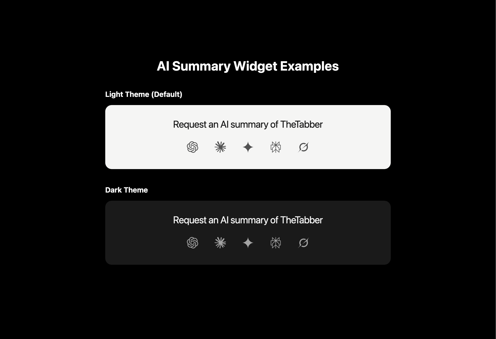

# AI Summary Widget

[](https://www.npmjs.com/package/@ai-summary/core)
[](https://www.npmjs.com/package/@ai-summary/react)

A beautiful widget that allows website visitors to request AI-generated summaries from popular AI services like ChatGPT, Claude, Gemini, Perplexity, and Grok.



## Features

- 🎨 **Light & Dark themes** with auto-detection
- 🔧 **Fully customizable** - colors, fonts, sizes
- ⚡ **Lightweight** - ~5KB core, ~2KB React wrapper
- 🌐 **Framework agnostic** - works with vanilla JS, React, Vue, etc.
- 📱 **Responsive** - mobile-friendly design
- ♿ **Accessible** - proper ARIA labels and keyboard navigation

Inspired by [@benln's post on X](https://x.com/benln/status/2011458564024680957).

## Installation

### Vanilla JavaScript

```bash
npm install @ai-summary/core
# or
pnpm add @ai-summary/core
```

### React

```bash
npm install @ai-summary/react
# or
pnpm add @ai-summary/react
```

## Quick Start

### Vanilla JavaScript

```html
<div id="ai-summary"></div>

<script type="module">
  import { createAISummary } from '@ai-summary/core';
  import '@ai-summary/core/styles';

  createAISummary({
    target: '#ai-summary',
    subject: 'TheTabber',
    // Optional: customize the query
    query: 'Explain what TheTabber offers as a service...'
  });
</script>
```

### React

```tsx
import { AISummary } from '@ai-summary/react';

function App() {
  return (
    <AISummary 
      subject="TheTabber"
      theme="light"
      // Optional: customize the query
      query="Explain what TheTabber offers as a service..."
    />
  );
}
```

## Configuration

### Props / Options

| Property | Type | Default | Description |
|----------|------|---------|-------------|
| `subject` | `string` | **required** | The subject to summarize (e.g., "TheTabber") |
| `title` | `string` | `"Request an AI summary of"` | Title text before subject |
| `query` | `string` | See below | The prompt sent to AI services |
| `services` | `AIService[]` | All 5 services | Override which AI services to show |
| `theme` | `'light' \| 'dark' \| 'auto'` | `'light'` | Color theme |
| `styles` | `AISummaryStyles` | `{}` | Custom style overrides |
| `openInNewTab` | `boolean` | `true` | Open AI links in new tab |

### Custom Styling

```tsx
<AISummary 
  subject="TheTabber"
  styles={{
    backgroundColor: '#1a1a2e',
    textColor: '#eaeaea',
    iconColor: '#888',
    iconHoverColor: '#fff',
    iconSize: 32,
    fontFamily: 'Inter, sans-serif',
    borderRadius: '20px',
    padding: '40px 50px',
  }}
/>
```

### Custom Services

```tsx
import { AISummary, chatgptIcon, claudeIcon } from '@ai-summary/react';

<AISummary 
  subject="TheTabber"
  services={[
    { id: 'chatgpt', name: 'ChatGPT', icon: chatgptIcon, baseUrl: 'https://chat.openai.com/' },
    { id: 'claude', name: 'Claude', icon: claudeIcon, baseUrl: 'https://claude.ai/new' },
  ]}
/>
```

## Supported AI Services

| Service | URL |
|---------|-----|
| ChatGPT | chat.openai.com |
| Claude | claude.ai |
| Gemini | gemini.google.com |
| Perplexity | perplexity.ai |
| Grok | grok.x.ai |

## Development

```bash
# Clone the repository
git clone https://github.com/your-username/ai-summary.git
cd ai-summary

# Install dependencies
pnpm install

# Build all packages
pnpm build

# Development mode
pnpm dev
```

## License

MIT
